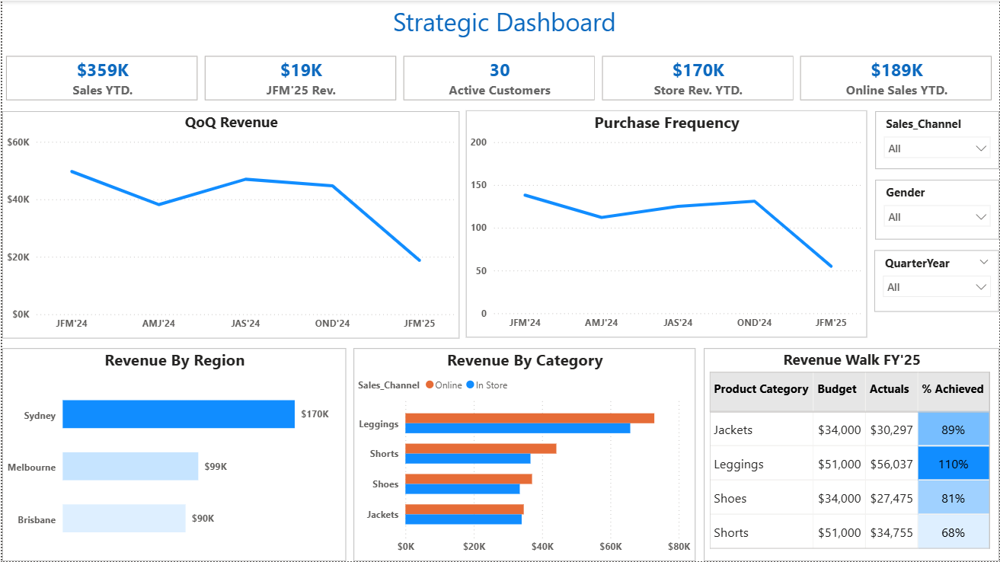
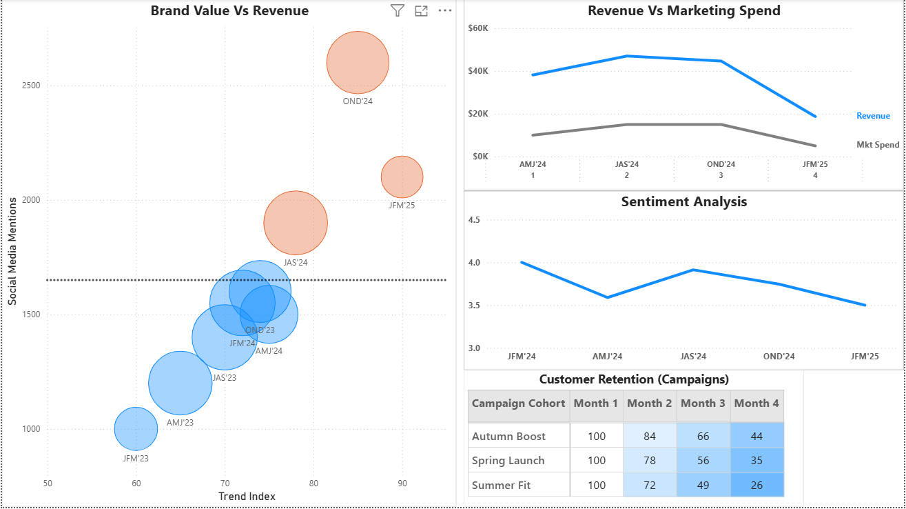
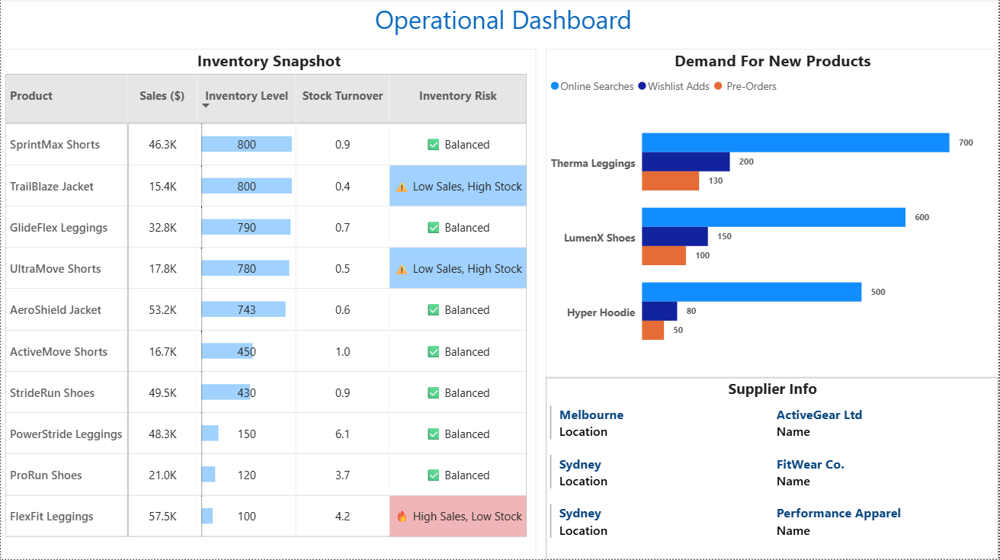

# Retail Sales & Operations Analytics Dashboard (Power BI)
This project presents an interactive Power BI analytics solution designed to analyze retail sales performance, customer purchasing behavior, and inventory operations.

---

## 📖 Project Overview

The project demonstrates the design and the implementation of a Power BI Dashboard.The solution provides insights at two levels of decision making:

1. **Strategic Dashboard** – High-level business performance for leadership
2. **Operational Dashboard** – Inventory health and product demand insights for operational teams

The dashboards enable stakeholders to monitor revenue performance, product demand, and inventory risks to support data-driven decision making.

---

## 🎯 Business Objectives

The goal of this project is to answer key business questions such as:

- How is overall revenue trending across quarters?
- Which product categories generate the highest revenue?
- How do online and store sales channels compare?
- Which regions contribute the most to total revenue?
- Effect of marketing strategies on revenue and customer retention ?
- Which products have inventory risks such as overstock or stockouts?
- What demand signals exist for upcoming products?

---

# Strategic Dashboard

The Strategic Dashboard provides leadership with a high-level overview of business performance. It is divided into two parts. The first one focuses on Revenue while the second part focuses on Marketing, sentiment analysis and Brand Value.

**Strategic Dashboard - 1**

<p align="center">  </p>

**Key Metrics**

- Sales YTD
- Current Quarter Revenue
- Active Customers
- Store Revenue vs Online Revenue
- % Budget Achieved in FY

**Key Visualizations**

- Quarter-over-Quarter Revenue Trend
- Purchase Frequency Analysis
- Revenue by Region
- Revenue by Product Category
- Budget vs Actual Revenue Comparison
- Revenue Walk Table

**Main Insights**

- Sydney generates the highest regional revenue.
- Online sales slightly outperform in-store sales.
- Leggings category exceeded budget targets.
- Shorts category underperformed compared to budget expectations.
- Dip in revenue from JFM'24 to JFM'25 which is reflected in the purchase frequency as well.
- Leggings have over achieved the budget. Rest all below the budget.

**Strategic Dashboard - 2**

<p align="center">  </p>

**Key Metrics**

- Social Media Mentions
- Marketing Spend
- Sentiment Index
- Customer Retention

**Key Visualizations**

- Brand Value Vs Revenue Bubble Chart
- QoQ Revenue Vs Marketing Spend
- MoM Customer Retention Table

**Main Insights**

- Revenue Increases with an increase in Social Media Mentions.
- Quarters with more marketing spend show more revenue generation.
- Customer Retention is maximum till the second month of the campaign.

---

## Operational Dashboard

The Operational Dashboard focuses on product performance and inventory management.

<p align="center">  </p>
Key Visualizations

**Key Metrics**

- Inventory Level
- Stock Turnover
- Inventory Risk
- Online Searches, Wishlists, Pre-Orders

**Key Visualizations**

- Inventory Snapshot Table
- Demand Signal for upcoming Products
- Supplier Information

**Main Insights**

- Trailbaze Jackets and Ultra Move shorts have high Inventory stock but low sales (Low Inventory Risk). 
- FlexFit Leggings have low inventory but high sales (Inventory Risk very high)
- Among upcoming products Therma Leggings has the most demand as indicated by pre orders and wishlist additions.
- Online Searches is directly proportional to product demand.

---

## Key DAX Measures Implemented

Several DAX calculations were implemented to derive business metrics, including:

- Sales YTD
- Purchase Count
- Inventory Turnover
- Inventory Risk Classification
- Average Product Rating
- Revenue by Sales Channel
- Budget vs Actual Variance

These measures enable deeper insights into sales performance, customer activity, and inventory efficiency.

---

##  ⚙️Tech Stack

- Power BI
- Power Query
- DAX
- Excel

---

# 🚀 How to Use This Project

1️⃣ Clone this repository

git clone https://github.com/jasmeet0494/Retail-Sales---Operations-Analytics-Dashboard.git

2️⃣ Open the Power BI file

Modern_Analytics_Dashboard.pbip

3️⃣ Explore the dashboard using filters

---

## 📂Repository Structure

```
Retail-Sales---Operations-Analytics-Dashboard/
│
├── datasets/                                             # Raw dataset used for the project 
│
├── docs/                                                 # Project Files
│      ├── dashboard                                      # folder for dashboard file
│                ├── Modern_Analytics_Dashboard.pbip      # Power Bi file
│      ├── screenshots                                    # Screenshots folder
│                ├── Strategic_dashboard_1.png            # Strategic Dashboard 1 screenshot
│                ├── Strategic_dashboard_2.png            # Strategic Dashboard 2 screenshot
│                ├── Operational_dashboard_1.png          # Operational Dashboard 1 screenshot
│                ├── operational_dashboard_2.png          # Operational Dashboard 2 screenshot
├── README.md                                             # Project overview and instructions

```

---
